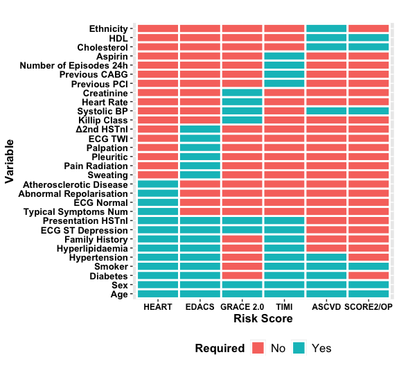

<!-- README.md is generated from README.Rmd. Please edit that file -->

# RiskScorescvd

<!-- badges: start -->

[](https://github.com/dvicencio/RiskScorescvd/actions/workflows/R-CMD-check.yaml)
[](https://www.linkedin.com/in/daniel-perez-vicencio-700549a0/)
<!-- badges: end -->

**Chest pain? Calculate your cardiovascular risk score.**

The goal of RiskScorescvd r package is to calculate the most commonly
used cardiovascular risk scores.

We have developed five of the most commonly used risk scores with a
dependency (ASCVD \[PooledCohort\]) making the following available:

- HEART
- EDACS
- GRACE 2.0
- TIMI
- SCORE2/OP
- ASCVD

## Installation

You can install the development version of RiskScorescvd from
[GitHub](https://github.com/) with:

``` r
# install.packages("devtools")
devtools::install_github("dvicencio/RiskScorescvd")
```

## Required variables for each risk score



## Example

This is a basic example of how the data set should look to calculate all
risk scores available in the package:

``` r
library(RiskScorescvd)
#> Loading required package: PooledCohort
# Create a data frame or list with the necessary variables
 # Set the number of rows
 num_rows <- 100
 
 # Create a large dataset with 100 rows
  cohort_xx <- data.frame(
   typical_symptoms.num = as.numeric(sample(0:6, num_rows, replace = TRUE)),
   ecg.normal = as.numeric(sample(c(0, 1), num_rows, replace = TRUE)),
   abn.repolarisation = as.numeric(sample(c(0, 1), num_rows, replace = TRUE)),
   ecg.st.depression = as.numeric(sample(c(0, 1), num_rows, replace = TRUE)),
   Age = as.numeric(sample(30:80, num_rows, replace = TRUE)),
   diabetes = sample(c(1, 0), num_rows, replace = TRUE),
   smoker = sample(c(1, 0), num_rows, replace = TRUE),
   hypertension = sample(c(1, 0), num_rows, replace = TRUE),
   hyperlipidaemia = sample(c(1, 0), num_rows, replace = TRUE),
   family.history = sample(c(1, 0), num_rows, replace = TRUE),
   atherosclerotic.disease = sample(c(1, 0), num_rows, replace = TRUE),
   presentation_hstni = as.numeric(sample(10:100, num_rows, replace = TRUE)),
   Gender = sample(c("male", "female"), num_rows, replace = TRUE),
   sweating = as.numeric(sample(c(0, 1), num_rows, replace = TRUE)),
   pain.radiation = as.numeric(sample(c(0, 1), num_rows, replace = TRUE)),
   pleuritic = as.numeric(sample(c(0, 1), num_rows, replace = TRUE)),
   palpation = as.numeric(sample(c(0, 1), num_rows, replace = TRUE)),
   ecg.twi = as.numeric(sample(c(0, 1), num_rows, replace = TRUE)),
   second_hstni = as.numeric(sample(1:200, num_rows, replace = TRUE)),
   killip.class = as.numeric(sample(1:4, num_rows, replace = TRUE)),
   systolic.bp = as.numeric(sample(40:300, num_rows, replace = TRUE)),
   heart.rate = as.numeric(sample(0:300, num_rows, replace = TRUE)),
   creat = as.numeric(sample(0:4, num_rows, replace = TRUE)),
   cardiac.arrest = as.numeric(sample(c(0, 1), num_rows, replace = TRUE)),
   previous.pci = as.numeric(sample(c(0, 1), num_rows, replace = TRUE)),
   previous.cabg = as.numeric(sample(c(0, 1), num_rows, replace = TRUE)),
   aspirin = as.numeric(sample(c(0, 1), num_rows, replace = TRUE)),
   number.of.episodes.24h = as.numeric(sample(0:20, num_rows, replace = TRUE)),
   total.chol = as.numeric(sample(5:100, num_rows, replace = TRUE)),
   total.hdl = as.numeric(sample(2:5, num_rows, replace = TRUE)),
   Ethnicity = sample(c("white", "black", "asian", "other"), num_rows, replace = TRUE)
 )

  str(cohort_xx)
#> 'data.frame':    100 obs. of  31 variables:
#>  $ typical_symptoms.num   : num  6 5 2 5 1 3 1 1 1 2 ...
#>  $ ecg.normal             : num  0 1 0 0 1 0 1 1 0 1 ...
#>  $ abn.repolarisation     : num  1 1 0 1 1 1 0 1 0 0 ...
#>  $ ecg.st.depression      : num  1 1 0 1 1 0 0 1 1 1 ...
#>  $ Age                    : num  70 77 51 64 77 32 70 79 56 57 ...
#>  $ diabetes               : num  1 0 1 0 0 1 0 1 0 1 ...
#>  $ smoker                 : num  1 0 0 1 0 1 0 1 1 0 ...
#>  $ hypertension           : num  0 1 1 1 1 0 1 1 1 1 ...
#>  $ hyperlipidaemia        : num  1 0 1 0 0 1 1 1 1 0 ...
#>  $ family.history         : num  1 1 0 0 1 0 1 1 0 1 ...
#>  $ atherosclerotic.disease: num  1 1 0 1 0 1 1 1 1 0 ...
#>  $ presentation_hstni     : num  10 56 97 86 78 94 63 39 63 89 ...
#>  $ Gender                 : chr  "male" "female" "female" "male" ...
#>  $ sweating               : num  1 0 1 1 1 1 0 1 1 0 ...
#>  $ pain.radiation         : num  1 0 1 0 0 0 0 1 1 0 ...
#>  $ pleuritic              : num  0 0 0 0 0 1 0 0 1 0 ...
#>  $ palpation              : num  1 1 0 0 0 1 0 0 1 0 ...
#>  $ ecg.twi                : num  1 1 0 1 0 0 1 1 0 1 ...
#>  $ second_hstni           : num  161 124 9 65 116 6 134 65 106 121 ...
#>  $ killip.class           : num  3 4 3 1 3 2 2 3 4 3 ...
#>  $ systolic.bp            : num  252 51 59 166 85 145 279 246 85 101 ...
#>  $ heart.rate             : num  61 64 23 52 294 164 135 74 244 217 ...
#>  $ creat                  : num  4 3 4 4 3 3 2 0 2 0 ...
#>  $ cardiac.arrest         : num  0 1 0 0 0 1 1 0 1 1 ...
#>  $ previous.pci           : num  1 1 1 1 1 0 1 0 0 0 ...
#>  $ previous.cabg          : num  1 0 1 0 1 0 0 0 0 1 ...
#>  $ aspirin                : num  0 1 0 1 0 1 0 1 1 1 ...
#>  $ number.of.episodes.24h : num  5 12 17 19 2 16 17 19 0 3 ...
#>  $ total.chol             : num  34 29 42 97 36 41 70 56 28 7 ...
#>  $ total.hdl              : num  5 3 3 3 2 3 2 5 3 3 ...
#>  $ Ethnicity              : chr  "other" "white" "white" "asian" ...
```

## Calculation and Results

This is a basic example of how to calculate all risk scores available in
the package and create a new data set with 12 new variables of the
calculated and classified risk scores:

``` r
# Call the function with the cohort_xx to calculate all risk scores available in the package
new_data_frame <- calc_scores(data = cohort_xx)
 
# Select columns created after calculation
All_scores <- new_data_frame %>% select(HEART_score, HEART_strat, EDACS_score, EDACS_strat, GRACE_score, GRACE_strat, TIMI_score, TIMI_strat, SCORE2_score, SCORE2_strat, ASCVD_score, ASCVD_strat)

# Observe the results
head(All_scores)
#> # A tibble: 6 × 12
#> # Rowwise: 
#>   HEART_score HEART_strat   EDACS_score EDACS_strat  GRACE_score GRACE_strat  
#>         <dbl> <ord>               <dbl> <ord>              <dbl> <ord>        
#> 1           8 High risk              20 Not low risk         110 Moderate risk
#> 2          10 High risk              10 Not low risk         191 High risk    
#> 3           7 High risk              14 Not low risk         111 Moderate risk
#> 4           8 High risk              19 Not low risk          95 Moderate risk
#> 5           7 High risk              19 Not low risk         208 High risk    
#> 6           5 Moderate risk           5 Not low risk          72 Low risk     
#> # ℹ 6 more variables: TIMI_score <dbl>, TIMI_strat <ord>, SCORE2_score <dbl>,
#> #   SCORE2_strat <ord>, ASCVD_score <dbl>, ASCVD_strat <ord>

# Create a summary of them to obtain an initial idea of distribution
summary(All_scores)
#>   HEART_score           HEART_strat  EDACS_score          EDACS_strat
#>  Min.   : 2.00   Low risk     : 7   Min.   :-8.00   Low risk    : 1  
#>  1st Qu.: 5.00   Moderate risk:56   1st Qu.: 5.75   Not low risk:99  
#>  Median : 6.00   High risk    :37   Median :11.00                    
#>  Mean   : 6.02                      Mean   :10.44                    
#>  3rd Qu.: 7.00                      3rd Qu.:15.25                    
#>  Max.   :10.00                      Max.   :24.00                    
#>   GRACE_score           GRACE_strat   TIMI_score           TIMI_strat
#>  Min.   : 15.0   Low risk     :26   Min.   :1.00   Very low risk: 0  
#>  1st Qu.: 86.0   Moderate risk:38   1st Qu.:3.00   Low risk     : 6  
#>  Median :106.5   High risk    :36   Median :4.00   Moderate risk:51  
#>  Mean   :106.9                      Mean   :4.21   High risk    :43  
#>  3rd Qu.:126.5                      3rd Qu.:5.00                     
#>  Max.   :208.0                      Max.   :6.00                     
#>   SCORE2_score           SCORE2_strat  ASCVD_score            ASCVD_strat
#>  Min.   :  0.00   Very low risk: 0    Min.   :0.0000   Very low risk: 9  
#>  1st Qu.: 25.00   Low risk     : 5    1st Qu.:0.1200   Low risk     : 8  
#>  Median : 98.50   Moderate risk: 8    Median :0.3150   Moderate risk:20  
#>  Mean   : 69.38   High risk    :87    Mean   :0.4526   High risk    :63  
#>  3rd Qu.:100.00                       3rd Qu.:0.8600                     
#>  Max.   :100.00                       Max.   :1.0000
```
